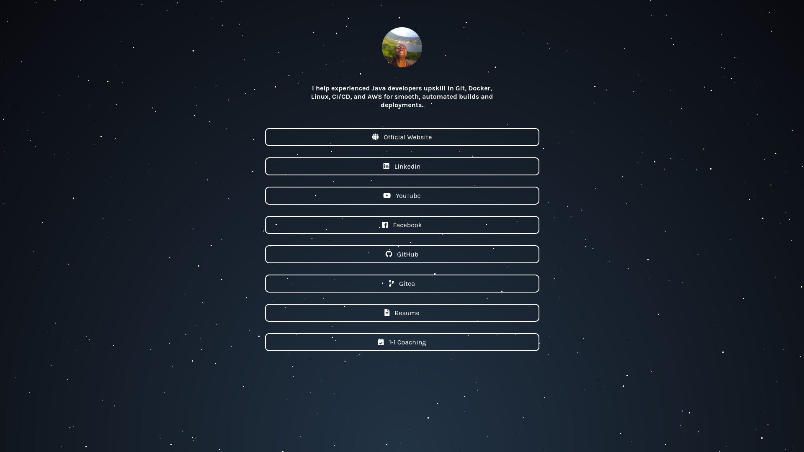

# @softwareshinobi's Link Hub

Welcome to the official repository for my personal link hub page!

## 🌟 About This Project

This repository hosts the source code for my custom-built link hub page – a central place to find all my important online presences and resources. Think of it as a personalized, self-hosted version of a "link-in-bio" page, designed with a unique animated background and custom styling to reflect the @softwareshinobi brand.

The page provides quick and easy access to my official website, social media profiles, professional details, project repositories, and ways to connect or collaborate with me.

## 🔗 My Links

Here's a collection of my key online destinations:

* **🌐 Official Website:** [softwareshinobi.com](https://softwareshinobi.com)
* **▶️ YouTube Channel:** [My videos & tutorials](https://www.youtube.com/@softwareshinobi)
* **📄 Resume/CV:** [My professional experience](https://docs.google.com/document/d/10QNw6pYVD8Rmk0RXVreKRYqOTEiNgmUhNcOvbc0FlIs/edit?usp=sharing)
* **💻 GitHub Profile:** [@softwareshinobi on GitHub](https://github.com/softwareshinobi)
* **⚙️ Gitea (Self-Hosted Git):** [code.softwareshinobi.com](https://code.softwareshinobi.com)
* **🔗 LinkedIn:** [Connect with me on LinkedIn](https://linkedin.com/in/softwareshinobi)
* **👍 Facebook Page:** [Follow @softwareshinobi](https://www.facebook.com/softwareshinobi)
* **🤝 1-1 Coaching:** [1-1 dev coaching](https://softwareshinobi.com/coaching)

## 🛠️ Tech Stack

This page is built with:

* HTML5
* CSS3 (including custom animations)
* JavaScript (for dynamic elements like the parallax background)
* Font Awesome for icons

---

## 🚀 View It Live!

See the page in action and access all my links here:

**➡️ [links.softwareshinobi.com](https://links.softwareshinobi.com) ⬅️**
